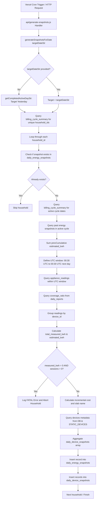

# Zenacle Home – Snapshot & Daily Report Architecture Audit

This document presents a comprehensive technical audit of the daily snapshot generation, reporting, and tariff calculation pipeline in the **Zenacle Home** codebase. It outlines the system flow, boundary logic, open session edge cases, database interactions, and production readiness gaps.

---

## 1. Scheduler Entry Point

The daily snapshot generation is scheduled via Vercel Cron and mapped to a serverless function entry point.

```
vercel.json (cron: "30 0 * * *")
   ↓
api/generate-snapshots.js (handler)
   ↓
generateSnapshotsForDate(date) [src/utils/snapshotGenerator.js]
```

### Configuration Details
*   **Trigger mechanism:** Vercel Cron engine triggers the HTTP endpoint `/api/generate-snapshots` daily.
*   **Cron schedule:** `30 0 * * *` (00:30 UTC), which corresponds to exactly **6:00 AM IST** (since IST is UTC+5:30).
*   **API handler file:** `api/generate-snapshots.js`. It exports a default serverless handler that reads an optional `date` query parameter (for manual override/backfills) and invokes the generator utility.
*   **Core utility execution:** `generateSnapshotsForDate()` in `src/utils/snapshotGenerator.js` is called.

---

## 2. Complete Execution Flow

The flowchart below represents the sequence of execution inside `generateSnapshotsForDate` when triggered:



---

## 3. Household Selection

The list of households to be processed is obtained dynamically to bypass Row-Level Security (RLS) recursion:

*   **Logic:** Rather than querying the `households` table directly (which could fail due to restrictive RLS policies or recursion bounds), the scheduler queries the `billing_cycle_summary` table to find all unique household IDs that have at least one billing cycle record.
*   **Query:**
    ```javascript
    const { data: cycles, error: cyclesErr } = await supabase
      .from('billing_cycle_summary')
      .select('household_id');
    ```
*   **Filtering:** The array is deduplicated in memory:
    ```javascript
    const householdIds = [...new Set((cycles || []).map(c => c.household_id))];
    ```
*   **RLS Workaround:** To insert snapshots into the tables, the generator uses the `SUPABASE_SERVICE_ROLE_KEY` (or fallback `SUPABASE_KEY`) to bypass RLS policies during serverless cron execution.

---

## 4. Daily Boundary Logic

Zenacle Home defines an "active day" based on a **6:00 AM IST** boundary instead of calendar midnight. 

### Conversion Rules
*   **IST Boundary:** An active day starts at **6:00 AM IST** and ends at **5:59:59 AM IST** of the following day.
*   **UTC Conversion:** 
    *   `6:00 AM IST` = `00:30:00 UTC` (represented as `00:30:00.000Z`)
    *   `5:59:59 AM IST` = `00:29:59 UTC` (represented as `00:29:59.999Z` of the next calendar day)

### Internal Variables (e.g., target date `2026-06-24`)
*   `snapshotDate` = `'2026-06-24'`
*   `periodStart` = `'2026-06-24T00:30:00.000Z'`
*   `nextDateStr` = `'2026-06-25'`
*   `periodEnd` = `'2026-06-25T00:30:00.000Z'`
*   **Query Filter Applied:**
    ```sql
    session_start >= '2026-06-24T00:30:00.000Z' AND session_start < '2026-06-25T00:30:00.000Z'
    ```

---

## 5. Appliance Reading Aggregation

Individual sessions from `appliance_readings` are compiled into device snapshots for the active day in `snapshotGenerator.js`:

1.  **Grouping:** Sessions matching the active day window are filtered in memory by `device_id`.
2.  **Duration:** Summed up as `total_duration_minutes` = $\sum \text{duration\_minutes}$.
3.  **Consumption:** Summed up as `measured_kwh` = $\sum \text{kwh\_consumed}$.
4.  **Sessions:** Counted as `total_sessions` = number of rows grouped under the device.
5.  **Cost Proportionality:** Daily device costs are calculated proportionally based on their share of the household's total measured energy:
    $$\text{device\_cost} = \frac{\text{device\_measured\_kwh}}{\text{total\_measured\_kwh}} \times \text{daily\_cost}$$
    *(If total household measured energy is 0, device cost is set to 0).*

---

## 6. Open Session Handling

Because sessions are classified solely by their **`session_start`** timestamp, boundary overlaps are handled as follows:

```
Timeline (IST)
|------------------------- Day A-1 -------------------------|-------------------------- Day A -------------------------|
6:00 AM                                                     6:00 AM                                                    6:00 AM
   |-- [Session 1: 6:30 AM - 11:30 AM] --|                     |                                                          |
   |                                                        |-- [Session 2: 5:30 AM - 7:30 AM] --|                     |
   |                                                           |                                |-[Session 3: 8:00 AM-...] |
```

*   **Case 1: Session starts inside the day but runs past 6:00 AM next day (e.g. Session 2: 5:30 AM to 7:30 AM)**
    *   Since `session_start` (5:30 AM) is before 6:00 AM, the session belongs to **Day A-1**.
    *   Its **entire** energy and duration are credited to **Day A-1**'s snapshot, even though 1.5 hours of runtime occurred on Day A.
*   **Case 2: Session is still open (i.e. `session_end` is `null`) when the 6:00 AM Cron runs**
    *   The cron query selects all readings where `session_start` is within the target day window.
    *   Because the session has not ended, the row contains only the partial `kwh_consumed` and `duration_minutes` recorded up to that moment.
    *   The generator reads these partial values and saves the snapshot.
    *   **Data Consistency Issue:** When the session later closes, the `appliance_readings` record is updated with the final values. However, the snapshot is **not updated retroactively**, leading to a permanent under-reporting of energy in the snapshot tables.

---

## 7. Energy Snapshot Generation

The `daily_energy_snapshots` table captures the aggregate daily performance for a household.

### Fields and Sources
*   `household_id`: Loop iteration variable.
*   `snapshot_date`: Target date string (`YYYY-MM-DD`).
*   `period_start`: Computed starting boundary (`snapshotDate + T00:30:00.000Z`).
*   `period_end`: Ending boundary string (`nextDateStr + T00:29:59.999Z`).
*   `measured_kwh`: $\sum \text{kwh\_consumed}$ across all readings in the period.
*   `estimated_kwh`: Calculated as `measured_kwh / coverageRatio` (reads `coverage_ratio` from `daily_reports`; defaults to `0.6` if missing).
*   `cost`: Calculated using progressive incremental slabs via `calculateIncrementalCost(prevCumulative, cumulativeEstimated, tariffVersion)`.
*   `total_sessions`: Count of reading rows in the period.
*   `total_duration_minutes`: Sum of `duration_minutes` for all readings in the period.
*   `tariff_version`: `'TN_OLD_2025'` if cycle start $< \text{'2026-05-28'}$, else `'TN_NEW_2026'`.
*   `slab_name`: Retreived via `getSlabName(cumulativeEstimated)`.

---

## 8. Device Snapshot Generation

Device snapshots are created in a loop for each device with non-zero usage.

### Fields and Sources
*   `device_id` & `device_name` / `device_type`: Derived from the `devices` table. If the device is not found, fallback to the inline `STATIC_DEVICES` map in `snapshotGenerator.js` is applied.
*   `floor` & `room`: Derived from `devices` table or `STATIC_DEVICES` fallback.
*   `snapshot_date`: Same as energy snapshot date.
*   `period_start` & `period_end`: Same as energy snapshot boundaries.
*   `measured_kwh`: Sum of `kwh_consumed` for that specific device's readings.
*   `total_sessions`: Count of readings for that device.
*   `total_duration_minutes`: Sum of `duration_minutes` for that device.
*   `cost`: Proportional cost allocated to the device:
    $$\text{cost} = \frac{\text{devMeasuredKwh}}{\text{totalMeasuredKwh}} \times \text{dailyCost}$$
*   `tariff_version` & `slab_name`: Inherited from the day's energy snapshot.

---

## 9. Billing Cycle Logic

The billing cycle determines the boundary limits, progressive slabs, and tariff versions for calculating costs.

*   **Where it is read:**
    *   **Backend:** `snapshotGenerator.js` queries `billing_cycle_summary` to establish the cycle start/end bounds and to calculate the cumulative energy of preceding days.
    *   **Frontend:** `useHomeData.js` reads cycles to determine current slab placements, project total usage, and calculate dynamic billing values.
*   **Where it is written:**
    *   **Backend:** The scheduler **never writes or updates** `billing_cycle_summary`.
    *   **Frontend:** `useHomeData.js` handles cycle initialization. If it detects that a cycle is expired or missing on load, it inserts a new cycle record:
        ```javascript
        await supabase.from('billing_cycle_summary').insert(newCycle);
        ```
*   **Files touching billing calculations:**
    *   [useHomeData.js](file:///c:/Users/Sumaiya/Downloads/Habtekt-main%20%281%29/Habtekt/src/hooks/useHomeData.js) (Frontend queries, cycle auto-creations, dynamic project cost calculations).
    *   [snapshotGenerator.js](file:///c:/Users/Sumaiya/Downloads/Habtekt-main%20%281%29/Habtekt/src/utils/snapshotGenerator.js) (Reads cycle start/end to calculate cumulative offsets).
    *   [tariff.js](file:///c:/Users/Sumaiya/Downloads/Habtekt-main%20%281%29/Habtekt/src/utils/tariff.js) (Utility functions for calculating the TNEB bill).
    *   [Home.jsx](file:///c:/Users/Sumaiya/Downloads/Habtekt-main%20%281%29/Habtekt/src/pages/Home.jsx) (Displays slab alerts and warning tips to the user).

---

## 10. Daily Report Logic

The `daily_reports` table is queried by the frontend to display weather details, saving insights, and daily summaries.

*   **Who writes it:** **No file in this codebase writes to `daily_reports`.** The application reads from this table, but does not contain logic to generate or insert reports. They are likely inserted by an external process or manual seed scripts.
*   **Who reads it:**
    *   `snapshotGenerator.js`: Reads `coverage_ratio` to compute estimated full home consumption.
    *   `useHomeData.js`: Fetches reports for the selected day to populate weather context, tip text, and weekly trends.
    *   `Reports.jsx` & `EnergyGraph.jsx` & `Energy.jsx`: Reads reports to render tips, weather details, and coverage stats in the UI.
*   **Stored Fields:** `report_date`, `coverage_ratio`, `whatsapp_message`, `tip_text`, `weather_context`, `delivery_status`, `delivered_at`, `estimated_full_home_kwh`, `cycle_measured_kwh_before`, `cycle_measured_kwh_after`.
*   **Missing Fields / Gaps:** The automated generation pipeline for daily reports is completely absent from the local repository.

---

## 11. WhatsApp Message Generation

*   **Files & Functions:** No WhatsApp generator, scheduler, or template engine exists in this codebase.
*   **Database reference:** The `daily_reports` table has a `whatsapp_message` text column that contains pre-rendered strings like:
    ```
    *Zenacle Daily Energy Report – 24 Jun*
    ...
    *📅 Billing Cycle: 28 May – 28 Jul*
    ...
    *💡 Tip*
    AC - Ground Floor ran for 7h 55min but it was a relatively cool night...
    ```
*   **Status:** Currently, WhatsApp messages are generated and sent by an external script or webhook.

---

## 12. Weather Context

*   **Source API & Timing:** No weather API fetching logic exists in this repository.
*   **Storage:** The JSON metadata for weather (minimum/maximum temperature, source, coordinates) is read directly from the `weather_context` field of the `daily_reports` table.
*   **Status:** Weather collection is handled by an external pipeline.

---

## 13. Tip Engine

*   **Implementation:** No algorithmic engine, rule sets, or AI prompt templates are defined in the codebase to generate `tip_text`.
*   **UI Fallbacks:** In [Home.jsx](file:///c:/Users/Sumaiya/Downloads/Habtekt-main%20%281%29/Habtekt/src/pages/Home.jsx) and [Energy.jsx](file:///c:/Users/Sumaiya/Downloads/Habtekt-main%20%281%29/Habtekt/src/pages/Energy.jsx), mock static tips are hardcoded for cases where the report does not exist:
    *   *Example:* `"No appliances are drawing power right now. Your home is in deep-sleep mode. *💡 Tip* Unplug standby electronics..."`
*   **Status:** Dynamic tips are generated externally and fetched from the `daily_reports` table.

---

## 14. Tariff Calculation

The application uses two separate tariff engines, leading to calculation discrepancies.

### 1. Client-Side Flat Bill Calculator (`src/utils/tariff.js`)
Calculates the bill for a total number of units. It selects the slab configuration (`below500` or `above500`) based on whether total units exceed 500, then applies calculations from zero:
```javascript
export function calculateTNEBBill(units) {
  if (!units || units <= 0) return 0;
  const slabs = getSlabs(units);
  let total = 0;
  for (const slab of slabs) {
    if (units < slab.min) break;
    const inSlab = Math.min(units, slab.max) - slab.min + 1;
    total += inSlab * slab.rate;
  }
  return total;
}
```

### 2. Backend Progressive Incremental Calculator (`src/utils/snapshotGenerator.js`)
Calculates the cost of an *increment* of units consumed between days, without retroactively altering past days' rates. It also supports different versions (`TN_OLD_2025` and `TN_NEW_2026`).

### Slab Configurations Mismatches & Duplications
*   **Duplication:** The tariff slabs object (`TARIFFS`) is duplicated in `snapshotGenerator.js` and `backfill_daily_snapshots.js`.
*   **Inconsistency:** Because TNEB tariffs change retroactively once a household crosses 500 units (e.g., units 101-200 are no longer free but charged at ₹4.70/unit), the sum of daily snapshot costs calculated incrementally will **not** equal the final bill calculated by `calculateTNEBBill(totalUnits)`. A difference of up to **₹470+** can occur at the end of the cycle.

---

## 15. Current Problems

| Problem | File | Root Cause |
| :--- | :--- | :--- |
| **Retroactive Slab Shift Discrepancy** | `src/utils/snapshotGenerator.js` & `src/utils/tariff.js` | Daily snapshot costs are computed incrementally and locked. When the household crosses 500 cumulative units, TNEB shifts the entire billing scale (retroactively charging for previously free slabs). The scheduler does not adjust historical daily snapshots, leading to a mismatch between daily sums and cycle-end totals. |
| **Race Condition on Open Sessions** | `src/utils/snapshotGenerator.js` | The cron runs at 6:00 AM IST. Sessions that are still open (`session_end` is `null`) are processed with their partial consumption. When they close later, the updated consumption is never synced to the daily snapshot, causing permanent energy under-reporting. |
| **Missing Billing Cycle Sync** | `src/utils/snapshotGenerator.js` & `src/hooks/useHomeData.js` | Billing cycle updates (e.g., updating `kwh_accumulated` and initializing new cycles) are performed by the client frontend on load. If a user does not open the app, new cycles are never created in the database and the scheduler falls back to guessing dates. |
| **Missing Report and Message Pipeline** | Workspace-wide | The codebase contains no logic to insert daily reports, query weather APIs, trigger the Tip Engine, or generate WhatsApp message templates. The backend reads them, but there is no writer. |
| **Duplicate Slab Configurations** | `src/utils/tariff.js`, `src/utils/snapshotGenerator.js`, `backfill_daily_snapshots.js` | Multiple files maintain duplicate copies of tariff slab limits and rates, making maintenance prone to desynchronization. |

---

## 16. Database Write Matrix

The following table summarizes the CRUD operations performed by files in the codebase:

| Table | Insert | Update | Read | File |
| :--- | :---: | :---: | :---: | :--- |
| **`appliance_readings`** | ❌ | ❌ | ✅ | `snapshotGenerator.js`, `useHomeData.js`, `Reports.jsx` |
| **`daily_energy_snapshots`** | ✅ | ❌ | ✅ | `snapshotGenerator.js`, `useHomeData.js`, `backfill_daily_snapshots.js` |
| **`daily_device_snapshots`** | ✅ | ❌ | ✅ | `snapshotGenerator.js`, `useHomeData.js`, `backfill_daily_snapshots.js` |
| **`billing_cycle_summary`** | ✅ | ❌ | ✅ | `useHomeData.js` (Inserts on load), `snapshotGenerator.js` (Reads metadata) |
| **`daily_reports`** | ❌ | ❌ | ✅ | `snapshotGenerator.js`, `useHomeData.js`, `Reports.jsx` |
| **`households`** | ❌ | ❌ | ✅ | `useHomeData.js`, `AuthContext.jsx` |
| **`devices`** | ❌ | ❌ | ✅ | `snapshotGenerator.js`, `useHomeData.js` |
| **`tariff_slabs`** | ❌ | ❌ | ❌ | *Not referenced in code. Slabs are hardcoded in source files.* |

---

## 17. Production Readiness

### Snapshot Generator
`8 / 10`
*Reason:* The snapshot engine is stable, contains idempotency guardrails, aggregates sessions correctly by 6 AM IST boundaries, and handles device allocations. However, it suffers from the Open Session Race Condition (reads incomplete sessions) and does not adjust for Retroactive Slab Changes.

### Billing Cycle
`4 / 10`
*Reason:* The cycle initialization logic is placed on the client-side (`useHomeData.js`). If a user doesn't log in, new cycles are not created, and the backend cannot update cumulative cycle values. This should be moved to the cron scheduler.

### Daily Reports
`0 / 10`
*Reason:* The report generator does not exist in this codebase. There is no weather integration, AI tip engine, or WhatsApp template compilation.

---

## 18. Refactoring Recommendations

*   **Move Billing Cycle Maintenance to Backend Scheduler:**
    Modify the daily cron to inspect and update `billing_cycle_summary`. Automatically initialize new cycles and update the cumulative `kwh_accumulated` field directly from the database rather than relying on frontend hooks.
*   **Resolve the Open Session Race Condition:**
    When the cron job runs, it should either skip processing open sessions (waiting until they are closed) or implement a **sync/upsert window** that re-evaluates the past 2–3 days of snapshots to catch closed session updates.
*   **Consolidate Tariff Calculations:**
    Expose a single, unified tariff calculator utility. Provide a function to recalculate the actual retroactive slab shift when crossing 500 units and apply the retroactive cost adjustment to the current daily snapshot.
*   **Implement the 8 AM Report Pipeline:**
    Build a secondary serverless cron job (scheduled for `30 2 * * *` UTC / 8:00 AM IST) that reads daily snapshots, calls the Weather API, runs the AI Tip Engine, generates the WhatsApp message string, and inserts the record into `daily_reports`.
*   **Use Snapshots as the Single Source of Truth:**
    Transition the frontend to query `daily_energy_snapshots` and `daily_device_snapshots` for all calculations, rather than performing live sums of raw `appliance_readings` on load.
